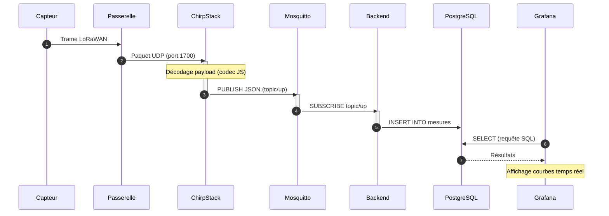

## About Me :
French IT Student, i'm currently learning : - Python - Cybersecurity - Networks   

## GitHub Stats :

<!--  -->

```mermaid
sequenceDiagram
    autonumber
    participant Capteur
    participant Passerelle
    participant ChirpStack
    participant Mosquitto
    participant Backend
    participant PostgreSQL
    participant Grafana

    Capteur->>Passerelle: Trame LoRaWAN
    Passerelle->>ChirpStack: Paquet UDP (port 1700)
    activate ChirpStack
    Note over ChirpStack: Décodage payload (codec JS)
    ChirpStack->>Mosquitto: PUBLISH JSON (topic/up)
    deactivate ChirpStack
    activate Mosquitto
    Mosquitto->>Backend: SUBSCRIBE topic/up
    deactivate Mosquitto
    activate Backend
    Backend->>PostgreSQL: INSERT INTO mesures
    deactivate Backend
    Grafana->>PostgreSQL: SELECT (requête SQL)
    PostgreSQL-->>Grafana: Résultats
    Note over Grafana: Affichage courbes temps réel
```
